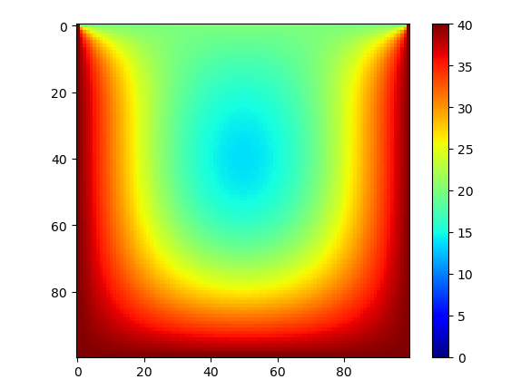
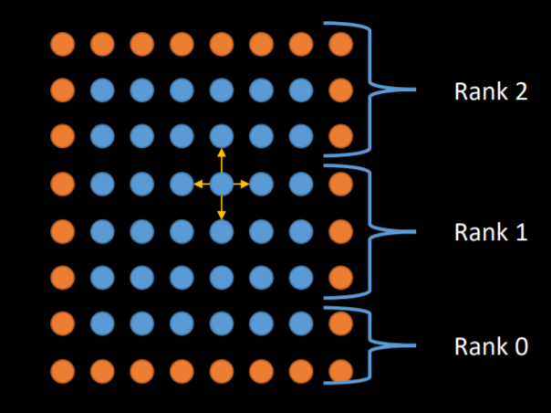

# Parallel Computing Assignment

## Question 1.

A one-dimensional ring Cartesian process topology is used to convey information 50 times.

```python
dims = [Np] # One elements in this list so it is one-dim, 
# Np is the number of processes which shows how many nodes in the ring
periods = [True] # a ring is periodic in it first and only dim
ring_comm = comm.Create_cart(dims, periods)
```

The source codes can be seen in follow files:

```shell
ring.py
```

**command**:

```python
 mpiexec -n 5 python MSDM5001\ring.py
```

**result**:

_(The output's order is not the original computation order.)_

```shell
node 2 pass a message from node 1 to node 3 [loop counter: 1]
node 2 pass a message from node 1 to node 3 [loop counter: 2]
node 2 pass a message from node 1 to node 3 [loop counter: 3]
node 2 pass a message from node 1 to node 3 [loop counter: 4]
node 2 pass a message from node 1 to node 3 [loop counter: 5]
node 2 pass a message from node 1 to node 3 [loop counter: 6]
node 2 pass a message from node 1 to node 3 [loop counter: 7]
node 2 pass a message from node 1 to node 3 [loop counter: 8]
node 2 pass a message from node 1 to node 3 [loop counter: 9]
node 2 pass a message from node 1 to node 3 [loop counter: 10]
node 2 pass a message from node 1 to node 3 [loop counter: 11]
node 2 pass a message from node 1 to node 3 [loop counter: 12]
node 2 pass a message from node 1 to node 3 [loop counter: 13]
node 2 pass a message from node 1 to node 3 [loop counter: 14]
node 2 pass a message from node 1 to node 3 [loop counter: 15]
node 2 pass a message from node 1 to node 3 [loop counter: 16]
node 2 pass a message from node 1 to node 3 [loop counter: 17]
node 2 pass a message from node 1 to node 3 [loop counter: 18]
node 2 pass a message from node 1 to node 3 [loop counter: 19]
node 2 pass a message from node 1 to node 3 [loop counter: 20]
node 2 pass a message from node 1 to node 3 [loop counter: 21]
node 2 pass a message from node 1 to node 3 [loop counter: 22]
node 2 pass a message from node 1 to node 3 [loop counter: 23]
node 2 pass a message from node 1 to node 3 [loop counter: 24]
node 2 pass a message from node 1 to node 3 [loop counter: 25]
node 2 pass a message from node 1 to node 3 [loop counter: 26]
node 2 pass a message from node 1 to node 3 [loop counter: 27]
node 2 pass a message from node 1 to node 3 [loop counter: 28]
node 2 pass a message from node 1 to node 3 [loop counter: 29]
node 2 pass a message from node 1 to node 3 [loop counter: 30]
node 2 pass a message from node 1 to node 3 [loop counter: 31]
node 2 pass a message from node 1 to node 3 [loop counter: 32]
node 2 pass a message from node 1 to node 3 [loop counter: 33]
node 2 pass a message from node 1 to node 3 [loop counter: 34]
node 2 pass a message from node 1 to node 3 [loop counter: 35]
node 2 pass a message from node 1 to node 3 [loop counter: 36]
node 2 pass a message from node 1 to node 3 [loop counter: 37]
node 2 pass a message from node 1 to node 3 [loop counter: 38]
node 2 pass a message from node 1 to node 3 [loop counter: 39]
node 2 pass a message from node 1 to node 3 [loop counter: 40]
node 2 pass a message from node 1 to node 3 [loop counter: 41]
node 2 pass a message from node 1 to node 3 [loop counter: 42]
node 2 pass a message from node 1 to node 3 [loop counter: 43]
node 2 pass a message from node 1 to node 3 [loop counter: 44]
node 2 pass a message from node 1 to node 3 [loop counter: 45]
node 2 pass a message from node 1 to node 3 [loop counter: 46]
node 2 pass a message from node 1 to node 3 [loop counter: 47]
node 2 pass a message from node 1 to node 3 [loop counter: 48]
node 2 pass a message from node 1 to node 3 [loop counter: 49]
node 2 pass a message from node 1 to node 3 [loop counter: 50]
node 1 pass a message from node 0 to node 2 [loop counter: 1]
node 1 pass a message from node 0 to node 2 [loop counter: 2]
node 1 pass a message from node 0 to node 2 [loop counter: 3]
node 1 pass a message from node 0 to node 2 [loop counter: 4]
node 1 pass a message from node 0 to node 2 [loop counter: 5]
node 1 pass a message from node 0 to node 2 [loop counter: 6]
node 1 pass a message from node 0 to node 2 [loop counter: 7]
node 1 pass a message from node 0 to node 2 [loop counter: 8]
node 1 pass a message from node 0 to node 2 [loop counter: 9]
node 1 pass a message from node 0 to node 2 [loop counter: 10]
node 1 pass a message from node 0 to node 2 [loop counter: 11]
node 1 pass a message from node 0 to node 2 [loop counter: 12]
node 1 pass a message from node 0 to node 2 [loop counter: 13]
node 1 pass a message from node 0 to node 2 [loop counter: 14]
node 1 pass a message from node 0 to node 2 [loop counter: 15]
node 1 pass a message from node 0 to node 2 [loop counter: 16]
node 1 pass a message from node 0 to node 2 [loop counter: 17]
node 1 pass a message from node 0 to node 2 [loop counter: 18]
node 1 pass a message from node 0 to node 2 [loop counter: 19]
node 1 pass a message from node 0 to node 2 [loop counter: 20]
node 1 pass a message from node 0 to node 2 [loop counter: 21]
node 1 pass a message from node 0 to node 2 [loop counter: 22]
node 1 pass a message from node 0 to node 2 [loop counter: 23]
node 1 pass a message from node 0 to node 2 [loop counter: 24]
node 1 pass a message from node 0 to node 2 [loop counter: 25]
node 1 pass a message from node 0 to node 2 [loop counter: 26]
node 1 pass a message from node 0 to node 2 [loop counter: 27]
node 1 pass a message from node 0 to node 2 [loop counter: 28]
node 1 pass a message from node 0 to node 2 [loop counter: 29]
node 1 pass a message from node 0 to node 2 [loop counter: 30]
node 1 pass a message from node 0 to node 2 [loop counter: 31]
node 1 pass a message from node 0 to node 2 [loop counter: 32]
node 1 pass a message from node 0 to node 2 [loop counter: 33]
node 1 pass a message from node 0 to node 2 [loop counter: 34]
node 1 pass a message from node 0 to node 2 [loop counter: 35]
node 1 pass a message from node 0 to node 2 [loop counter: 36]
node 1 pass a message from node 0 to node 2 [loop counter: 37]
node 1 pass a message from node 0 to node 2 [loop counter: 38]
node 1 pass a message from node 0 to node 2 [loop counter: 39]
node 1 pass a message from node 0 to node 2 [loop counter: 40]
node 1 pass a message from node 0 to node 2 [loop counter: 41]
node 1 pass a message from node 0 to node 2 [loop counter: 42]
node 1 pass a message from node 0 to node 2 [loop counter: 43]
node 1 pass a message from node 0 to node 2 [loop counter: 44]
node 1 pass a message from node 0 to node 2 [loop counter: 45]
node 1 pass a message from node 0 to node 2 [loop counter: 46]
node 1 pass a message from node 0 to node 2 [loop counter: 47]
node 1 pass a message from node 0 to node 2 [loop counter: 48]
node 1 pass a message from node 0 to node 2 [loop counter: 49]
node 1 pass a message from node 0 to node 2 [loop counter: 50]
node 3 pass a message from node 2 to node 4 [loop counter: 1]
node 3 pass a message from node 2 to node 4 [loop counter: 2]
node 3 pass a message from node 2 to node 4 [loop counter: 3]
node 3 pass a message from node 2 to node 4 [loop counter: 4]
node 3 pass a message from node 2 to node 4 [loop counter: 5]
node 3 pass a message from node 2 to node 4 [loop counter: 6]
node 3 pass a message from node 2 to node 4 [loop counter: 7]
node 3 pass a message from node 2 to node 4 [loop counter: 8]
node 3 pass a message from node 2 to node 4 [loop counter: 9]
node 3 pass a message from node 2 to node 4 [loop counter: 10]
node 3 pass a message from node 2 to node 4 [loop counter: 11]
node 3 pass a message from node 2 to node 4 [loop counter: 12]
node 3 pass a message from node 2 to node 4 [loop counter: 13]
node 3 pass a message from node 2 to node 4 [loop counter: 14]
node 3 pass a message from node 2 to node 4 [loop counter: 15]
node 3 pass a message from node 2 to node 4 [loop counter: 16]
node 3 pass a message from node 2 to node 4 [loop counter: 17]
node 3 pass a message from node 2 to node 4 [loop counter: 18]
node 3 pass a message from node 2 to node 4 [loop counter: 19]
node 3 pass a message from node 2 to node 4 [loop counter: 20]
node 3 pass a message from node 2 to node 4 [loop counter: 21]
node 3 pass a message from node 2 to node 4 [loop counter: 22]
node 3 pass a message from node 2 to node 4 [loop counter: 23]
node 3 pass a message from node 2 to node 4 [loop counter: 24]
node 3 pass a message from node 2 to node 4 [loop counter: 25]
node 3 pass a message from node 2 to node 4 [loop counter: 26]
node 3 pass a message from node 2 to node 4 [loop counter: 27]
node 3 pass a message from node 2 to node 4 [loop counter: 28]
node 3 pass a message from node 2 to node 4 [loop counter: 29]
node 3 pass a message from node 2 to node 4 [loop counter: 30]
node 3 pass a message from node 2 to node 4 [loop counter: 31]
node 3 pass a message from node 2 to node 4 [loop counter: 32]
node 3 pass a message from node 2 to node 4 [loop counter: 33]
node 3 pass a message from node 2 to node 4 [loop counter: 34]
node 3 pass a message from node 2 to node 4 [loop counter: 35]
node 3 pass a message from node 2 to node 4 [loop counter: 36]
node 3 pass a message from node 2 to node 4 [loop counter: 37]
node 3 pass a message from node 2 to node 4 [loop counter: 38]
node 3 pass a message from node 2 to node 4 [loop counter: 39]
node 3 pass a message from node 2 to node 4 [loop counter: 40]
node 3 pass a message from node 2 to node 4 [loop counter: 41]
node 3 pass a message from node 2 to node 4 [loop counter: 42]
node 3 pass a message from node 2 to node 4 [loop counter: 43]
node 3 pass a message from node 2 to node 4 [loop counter: 44]
node 3 pass a message from node 2 to node 4 [loop counter: 45]
node 3 pass a message from node 2 to node 4 [loop counter: 46]
node 3 pass a message from node 2 to node 4 [loop counter: 47]
node 3 pass a message from node 2 to node 4 [loop counter: 48]
node 3 pass a message from node 2 to node 4 [loop counter: 49]
node 3 pass a message from node 2 to node 4 [loop counter: 50]
node 4 pass a message from node 3 to node 0 [loop counter: 1]
node 4 pass a message from node 3 to node 0 [loop counter: 2]
node 4 pass a message from node 3 to node 0 [loop counter: 3]
node 4 pass a message from node 3 to node 0 [loop counter: 4]
node 4 pass a message from node 3 to node 0 [loop counter: 5]
node 4 pass a message from node 3 to node 0 [loop counter: 6]
node 4 pass a message from node 3 to node 0 [loop counter: 7]
node 4 pass a message from node 3 to node 0 [loop counter: 8]
node 4 pass a message from node 3 to node 0 [loop counter: 9]
node 4 pass a message from node 3 to node 0 [loop counter: 10]
node 4 pass a message from node 3 to node 0 [loop counter: 11]
node 4 pass a message from node 3 to node 0 [loop counter: 12]
node 4 pass a message from node 3 to node 0 [loop counter: 13]
node 4 pass a message from node 3 to node 0 [loop counter: 14]
node 4 pass a message from node 3 to node 0 [loop counter: 15]
node 4 pass a message from node 3 to node 0 [loop counter: 16]
node 4 pass a message from node 3 to node 0 [loop counter: 17]
node 4 pass a message from node 3 to node 0 [loop counter: 18]
node 4 pass a message from node 3 to node 0 [loop counter: 19]
node 4 pass a message from node 3 to node 0 [loop counter: 20]
node 4 pass a message from node 3 to node 0 [loop counter: 21]
node 4 pass a message from node 3 to node 0 [loop counter: 22]
node 4 pass a message from node 3 to node 0 [loop counter: 23]
node 4 pass a message from node 3 to node 0 [loop counter: 24]
node 4 pass a message from node 3 to node 0 [loop counter: 25]
node 4 pass a message from node 3 to node 0 [loop counter: 26]
node 4 pass a message from node 3 to node 0 [loop counter: 27]
node 4 pass a message from node 3 to node 0 [loop counter: 28]
node 4 pass a message from node 3 to node 0 [loop counter: 29]
node 4 pass a message from node 3 to node 0 [loop counter: 30]
node 4 pass a message from node 3 to node 0 [loop counter: 31]
node 4 pass a message from node 3 to node 0 [loop counter: 32]
node 4 pass a message from node 3 to node 0 [loop counter: 33]
node 4 pass a message from node 3 to node 0 [loop counter: 34]
node 4 pass a message from node 3 to node 0 [loop counter: 35]
node 4 pass a message from node 3 to node 0 [loop counter: 36]
node 4 pass a message from node 3 to node 0 [loop counter: 37]
node 4 pass a message from node 3 to node 0 [loop counter: 38]
node 4 pass a message from node 3 to node 0 [loop counter: 39]
node 4 pass a message from node 3 to node 0 [loop counter: 40]
node 4 pass a message from node 3 to node 0 [loop counter: 41]
node 4 pass a message from node 3 to node 0 [loop counter: 42]
node 4 pass a message from node 3 to node 0 [loop counter: 43]
node 4 pass a message from node 3 to node 0 [loop counter: 44]
node 4 pass a message from node 3 to node 0 [loop counter: 45]
node 4 pass a message from node 3 to node 0 [loop counter: 46]
node 4 pass a message from node 3 to node 0 [loop counter: 47]
node 4 pass a message from node 3 to node 0 [loop counter: 48]
node 4 pass a message from node 3 to node 0 [loop counter: 49]
node 4 pass a message from node 3 to node 0 [loop counter: 50]
node 0 pass a message from node 4 to node 1 [loop counter: 1]
node 0 pass a message from node 4 to node 1 [loop counter: 2]
node 0 pass a message from node 4 to node 1 [loop counter: 3]
node 0 pass a message from node 4 to node 1 [loop counter: 4]
node 0 pass a message from node 4 to node 1 [loop counter: 5]
node 0 pass a message from node 4 to node 1 [loop counter: 6]
node 0 pass a message from node 4 to node 1 [loop counter: 7]
node 0 pass a message from node 4 to node 1 [loop counter: 8]
node 0 pass a message from node 4 to node 1 [loop counter: 9]
node 0 pass a message from node 4 to node 1 [loop counter: 10]
node 0 pass a message from node 4 to node 1 [loop counter: 11]
node 0 pass a message from node 4 to node 1 [loop counter: 12]
node 0 pass a message from node 4 to node 1 [loop counter: 13]
node 0 pass a message from node 4 to node 1 [loop counter: 14]
node 0 pass a message from node 4 to node 1 [loop counter: 15]
node 0 pass a message from node 4 to node 1 [loop counter: 16]
node 0 pass a message from node 4 to node 1 [loop counter: 17]
node 0 pass a message from node 4 to node 1 [loop counter: 18]
node 0 pass a message from node 4 to node 1 [loop counter: 19]
node 0 pass a message from node 4 to node 1 [loop counter: 20]
node 0 pass a message from node 4 to node 1 [loop counter: 21]
node 0 pass a message from node 4 to node 1 [loop counter: 22]
node 0 pass a message from node 4 to node 1 [loop counter: 23]
node 0 pass a message from node 4 to node 1 [loop counter: 24]
node 0 pass a message from node 4 to node 1 [loop counter: 25]
node 0 pass a message from node 4 to node 1 [loop counter: 26]
node 0 pass a message from node 4 to node 1 [loop counter: 27]
node 0 pass a message from node 4 to node 1 [loop counter: 28]
node 0 pass a message from node 4 to node 1 [loop counter: 29]
node 0 pass a message from node 4 to node 1 [loop counter: 30]
node 0 pass a message from node 4 to node 1 [loop counter: 31]
node 0 pass a message from node 4 to node 1 [loop counter: 32]
node 0 pass a message from node 4 to node 1 [loop counter: 33]
node 0 pass a message from node 4 to node 1 [loop counter: 34]
node 0 pass a message from node 4 to node 1 [loop counter: 35]
node 0 pass a message from node 4 to node 1 [loop counter: 36]
node 0 pass a message from node 4 to node 1 [loop counter: 37]
node 0 pass a message from node 4 to node 1 [loop counter: 39]
node 0 pass a message from node 4 to node 1 [loop counter: 40]
node 0 pass a message from node 4 to node 1 [loop counter: 41]
node 0 pass a message from node 4 to node 1 [loop counter: 42]
node 0 pass a message from node 4 to node 1 [loop counter: 44]
node 0 pass a message from node 4 to node 1 [loop counter: 45]
node 0 pass a message from node 4 to node 1 [loop counter: 46]
node 0 pass a message from node 4 to node 1 [loop counter: 47]
node 0 pass a message from node 4 to node 1 [loop counter: 50]
Time spend: 0.006306s
```

## Question 2.

The source codes can be seen in follow files:

```shell
serial_pi.py
parallel_pi.py
```

Parallel code's command:

```shell
mpiexec -n 5 python MSDM5001\parallel_pi.py
```

Parallel vs. Serial code:

```shell

3.1415925119969845
Serial Time Spend 1.107501745223999 s

3.1415925119969796
Parallel Time spend: 0.524364 s with 2 processes

3.141592511996992
Parallel Time spend: 0.346689 s with 3 processes

3.141592511997004
Parallel Time spend: 0.282426 s with 4 processes

3.1415925119969703
Parallel Time spend: 0.238940 s with 5 processes

3.1415925119969774
Parallel Time spend: 0.227875 s with 6 processes

```

## Question 3.

The **source codes** can be seen in follow files:

```shell
MC_pi_process.py
MC_Pi_thread_and_serial.py
```

**Process pool** VS **Thread pool** VS **Serial code**

```shell
3.1411028
process pool Time Spend 4.559331893920898 s

3.1415372
Thread pool Time Spend 17.874241590499878 s

3.1421956
Serial Time Spend 17.157341241836548 s
```

**The result shows that the performance of using thread pool is awful.**

The thread pool is more suitable for I/O operations, but not for this task, as the Python kernel only allows one thread to execute at a time. Also, some python's function within serial program already is a SIMD. Therefore, the thread level parallel code will not make a big difference of the performance, while the process pool have a much better performance. 

## Question 4.

The Laplacian (or Poisson) equation of temperature distribution can be numerical solved by using five point stencil method (for the PDE part) and  Euler's method (for the ODE part). 

Also, there is another numerical method. We can assume that every iteration of the evolution of temperature satisfies the Laplace condition

$${\displaystyle \nabla ^{2}f=0.}$$

Therefore, the value of a elements in the temperature matrix can be regarded as follows:

$$
4 T_{i, j}(t)= T_{i-1, j}(t-1)+T_{i+1, j}(t-1)+T_{i, j-1}(t-1)+T_{i, j+1}(t-1)
$$


After enough iteration times, the result will be the same as the result of the first method.

Both of these two methods' serial code can be seen in follows files:

```shell
laplacian_eq.py
```

_The result of 100*100 matix after 1000 iterations_:




However, using python to do the computation is too slow. Therefore I choosen using c to do this task.

The makefile, source code, and executable file can be found as follows:

```shell
makefile
laplacian_eq.c
laplacian_eq.h
laplacian_eq.exe
```

The environment configurations are

```shell

windows 10
intel i7-10750H 
6 cores
mpiexec (OpenRTE) 3.1.6
gcc 版本 10.2.0 (GCC)
GNU Make 4.3
CYGWIN_NT-10.0
```

_( For Linux or windows, MAC OS may cannot compile or run successfully, because of the difference of gcc and the head file <sys/time.h> )_


The basic idea of my parallel code is creating a one dim acyclic communicator first, and then split the task as follows: 



As in every iteration the value of boundary elements depends on others processes, it requires communication at every iteration, which may cause deadlocks. 

To solve this problem, I have tried multiple methods (e.g. copy the msg to some buffers by using MPI_Bsend and let process 0 to deal with it in the background). 

However, in the end, I chose a more intuitive approach, which is spliting the processes as two groups (odd rank group and even rank group), then let one group send msg first, recv msg later, while another group recv msg first and send msg later.

After finish all the computation, the collective communication func MPI_Gatherv are applied to get all the information.


### Command lines:

serial execution: 

```shell
mpiexec -n 1 laplacian_eq.exe --serial

or

mpiexec -n 1 laplacian_eq.exe -s
```

parallel execution: 

```shell
mpiexec -n 5 laplacian_eq.exe --parallel

or

mpiexec -n 5 laplacian_eq.exe -p
```

serial execution and print results:

```shell
mpiexec -n 1 laplacian_eq.exe --serial=p

or

mpiexec -n 1 laplacian_eq.exe -sp
```


parallel execution and print results:

```shell
mpiexec -n 5 laplacian_eq.exe --parallel=p

or

mpiexec -n 5 laplacian_eq.exe -pp
```

### Result

The improvement is not significant when matrix is small

1000*1000 matrix and 1000 iterations:

```shell
//serial
$ mpiexec -n 1 laplacian_eq.exe -s
time=4.7579890000

//parallel
$ mpiexec -n 5 laplacian_eq.exe -p
time=3.2698950000
```

However, when the matrix become large, the parallel code showed a huge improvement.

10000*10000 matrix and 1000 iteration:

```shell
// serial
$ mpiexec -n 1 laplacian_eq.exe -s
time=390.9852980000

//parallel
$ mpiexec -n 6 laplacian_eq.exe -p
time=110.5232600000
```